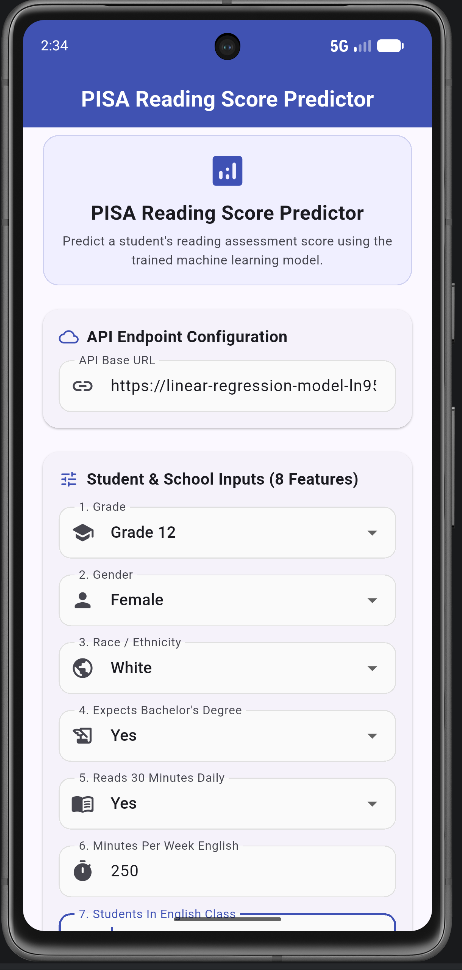
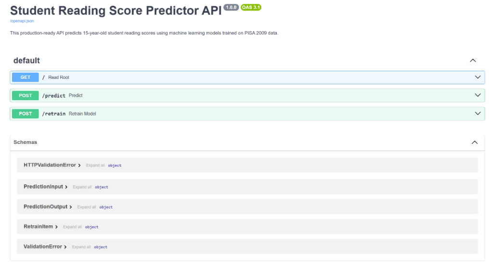
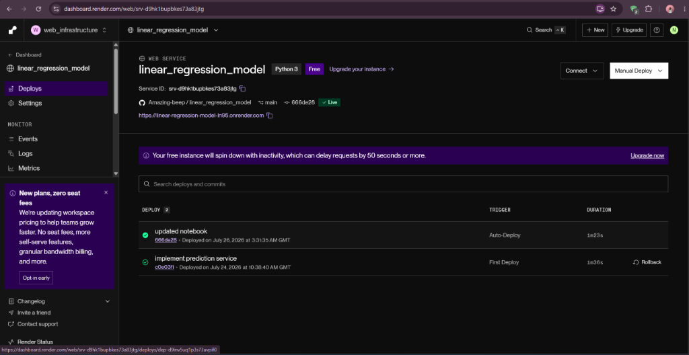

# PISA Reading Score Predictor: End-to-End Machine Learning System, FastAPI REST API, and Flutter Mobile Application

An end-to-end Machine Learning, RESTful API, and cross-platform mobile application solution designed to predict high school student reading literacy assessment scores using demographic, behavioral, and academic predictors from the international PISA 2009 evaluation dataset.

---

## Project Overview

### What the Project Does
The **PISA Reading Score Predictor** is an integrated machine learning solution comprising three core components:
1. **Machine Learning Pipeline**: A multivariate regression pipeline developed using Scikit-Learn that preprocesses student data and predicts continuous reading assessment scores (`readingScore`).
2. **FastAPI REST API**: A production-ready backend service exposing endpoints for real-time model inference (`POST /predict`) and dynamic model retraining (`POST /retrain`).
3. **Flutter Mobile Application**: A modern, single-page cross-platform mobile interface enabling educators, administrators, and researchers to enter student characteristics, submit prediction requests, and view instant score estimations.

### The Problem It Solves
Reading literacy is a foundational academic skill that strongly correlates with future academic success, economic opportunities, and cognitive development. Educational institutions and policymakers often lack objective, automated predictive tools to identify students at risk of low reading proficiency prior to high-stakes standardized assessment cycles. This system automates student risk assessment using standardized international evaluation data.

### Why Predicting Reading Scores is Useful
- **Early Intervention**: Enables schools to identify struggling readers early and implement targeted reading intervention programs.
- **Resource Allocation**: Helps administrators direct instructional budget, reading specialists, and classroom resources to environments with the greatest demonstrated need.
- **Policy Insights**: Quantifies the empirical impact of key factors such as daily reading habits, student academic expectations, instructional time, class size, and school size.

### Why the PISA 2009 Dataset Was Selected
The **PISA 2009 (Programme for International Student Assessment)** dataset, managed by the OECD (Organization for Economic Co-operation and Development), provides a globally representative sample of 15-year-old students. It combines continuous academic and structural variables with binary and categorical demographic indicators, making it ideal for supervised multivariate regression.

---

## Features

### Machine Learning
- **Robust Preprocessing Pipeline**: Scikit-Learn `ColumnTransformer` handling median/mode missing value imputation, standard feature scaling, and one-hot encoding without data leakage.
- **Trained Regression Model**: Optimized **Random Forest Regressor** (`n_estimators=150`, `max_depth=8`) delivering top performance across multiple evaluation metrics.
- **Model Persistence**: Serialized model (`best_model.joblib`) and preprocessor (`preprocessor.joblib`) saved for rapid API runtime loading.
- **Inference & Retraining**: Supports both single-sample score predictions and full online model retraining with new observations.

### FastAPI
- **`GET /`**: Health check and API metadata endpoint.
- **`POST /predict`**: Real-time prediction endpoint validating input payloads against strict Pydantic models.
- **`POST /retrain`**: In-memory and disk retraining endpoint that appends new records, updates datasets, refits pipelines, and overwrites model artifacts.
- **Interactive Documentation**: Automatic OpenAPI / Swagger UI (`/docs`) and ReDoc (`/redoc`).
- **Validation & Error Handling**: Pydantic schema validation (HTTP 422) and global exception handlers (HTTP 500).
- **CORS Support**: `CORSMiddleware` configured to enable cross-origin requests from web and mobile clients.

### Flutter Application
- **Material 3 UI**: Clean, modern interface designed with a custom indigo/cyan color scheme and responsive layout.
- **Strict Input Validation**: Client-side validation enforcing non-empty fields, valid number parsing, and boundary constraints.
- **Decoupled Architecture**: Reusable `PredictionService` separating networking logic from UI widgets.
- **User Experience**: Progress indicators during API execution, disabled button states, and dedicated result cards.
- **Comprehensive Error Handling**: Friendly error displays handling network disconnects, request timeouts, validation failures, and server errors.

### Deployment
- **Cloud Hosting**: Deployed on Render PaaS with public HTTPS access.

---

## Repository Structure

```
linear_regression_model/
├── README.md
└── summative/
    ├── API/
    │   ├── best_model.joblib
    │   ├── prediction.py
    │   ├── preprocessor.joblib
    │   └── requirements.txt
    ├── FlutterApp/
    │   ├── lib/
    │   │   ├── main.dart
    │   │   ├── models/
    │   │   │   ├── prediction_request.dart
    │   │   │   └── prediction_response.dart
    │   │   ├── screens/
    │   │   │   └── prediction_screen.dart
    │   │   ├── services/
    │   │   │   └── prediction_service.dart
    │   │   └── widgets/
    │   │       ├── loading_widget.dart
    │   │       └── prediction_card.dart
    │   ├── test/
    │   │   └── widget_test.dart
    │   ├── pubspec.yaml
    │   └── analysis_options.yaml
    ├── linear_regression/
    │   ├── data/
    │   │   ├── pisa2009test.csv
    │   │   └── pisa2009train.csv
    │   ├── images/
    │   │   ├── actual_vs_predicted.png
    │   │   ├── lr_scatter_after_fitting.png
    │   │   ├── lr_scatter_before_fitting.png
    │   │   └── sgd_loss_curve.png
    │   └── multivariate.ipynb
    ├── pyproject.toml
    ├── requirements.txt
    └── uv.lock
```

---

## Machine Learning Pipeline

### Dataset
- **Training Set (`pisa2009train.csv`)**: 3,663 raw observations (3,662 clean target rows), 24 columns.
- **Test Set (`pisa2009test.csv`)**: 1,570 clean observations, 24 columns.
- **Target Variable**: `readingScore` (Continuous score ranging approximately from 150 to 750 points).

### Feature Engineering & Selection
Eight features were selected out of 23 candidate predictors to balance predictive accuracy with mobile form usability:
1. `grade`: Student school grade level (Integer: 8 to 12).
2. `male`: Gender indicator (Binary: 0 = Female, 1 = Male).
3. `raceeth`: Race/Ethnicity category (Categorical string).
4. `expectBachelors`: Expects to obtain a Bachelor's degree (Binary: 0.0 = No, 1.0 = Yes).
5. `read30MinsADay`: Reads for pleasure at least 30 minutes daily (Binary: 0.0 = No, 1.0 = Yes).
6. `minutesPerWeekEnglish`: Weekly instructional time in English class (Continuous: 0 to 3000).
7. `studentsInEnglish`: Number of students in English class (Continuous: 0 to 100).
8. `schoolSize`: Total school enrollment size (Continuous: 0 to 10000).

### Preprocessing Architecture
A Scikit-Learn `ColumnTransformer` pipeline constructs a 14-dimensional feature vector:
- **Numerical Features** (`minutesPerWeekEnglish`, `studentsInEnglish`, `schoolSize`): Imputed with median values via `SimpleImputer` and scaled using `StandardScaler`.
- **Categorical Feature** (`raceeth`): Imputed with most frequent value via `SimpleImputer` and encoded using `OneHotEncoder(handle_unknown='ignore', sparse_output=False)`.
- **Binary Features** (`grade`, `male`, `expectBachelors`, `read30MinsADay`): Imputed with most frequent value via `SimpleImputer`.

### Model Training & Evaluation
Four regression models were trained on `X_train_prep` and evaluated on `X_test_prep`:

| Model | Test MAE | Test MSE | Test RMSE | Test $R^2$ |
| :--- | :---: | :---: | :---: | :---: |
| **Random Forest Regressor** | **61.42** | **6,052.18** | **77.80** | **0.3150** |
| **OLS Linear Regression** | 64.21 | 6,589.40 | 81.18 | 0.2581 |
| **SGD Regressor** | 64.30 | 6,595.12 | 81.21 | 0.2574 |
| **Decision Tree Regressor** | 64.60 | 6,804.85 | 82.49 | 0.2319 |

### Model Persistence
The winning **Random Forest Regressor** model (`best_model.joblib`) and fitted `ColumnTransformer` (`preprocessor.joblib`) are exported directly to `summative/API/`.

### Prediction Workflow
1. Raw JSON input payload received by FastAPI.
2. Construct single-row Pandas DataFrame matching training column names.
3. Transform input vector through `preprocessor.transform()`.
4. Pass 14-dimensional array to `model.predict()`.
5. Return formatted JSON response with estimated reading score.

---

## API Documentation

### Root Health Check: `GET /`
- **Purpose**: Verify API status and access documentation links.
- **Request Format**: None.
- **Response Format**: `application/json`

**Example Response**:
```json
{
  "status": "online",
  "service": "Student Reading Score Predictor API",
  "documentation": "/docs"
}
```

---

### Prediction Endpoint: `POST /predict`
- **Purpose**: Compute predicted reading score for a student.
- **Request Format**: `application/json`

**Example Request**:
```json
{
  "grade": 10,
  "male": 1,
  "raceeth": "White",
  "expectBachelors": 1.0,
  "read30MinsADay": 1.0,
  "minutesPerWeekEnglish": 250.0,
  "studentsInEnglish": 25.0,
  "schoolSize": 1200.0
}
```

**Response Format**: `application/json`

**Example Response**:
```json
{
  "predicted_reading_score": 542.85,
  "model": "Random Forest Regressor",
  "status": "success"
}
```

---

### Retraining Endpoint: `POST /retrain`
- **Purpose**: Append new observations to training data, refit pipeline and model, and overwrite saved joblib artifacts.
- **Request Format**: `application/json` (List of objects including features + actual `readingScore`).

**Example Request**:
```json
[
  {
    "grade": 11,
    "male": 0,
    "raceeth": "Hispanic",
    "expectBachelors": 1.0,
    "read30MinsADay": 1.0,
    "minutesPerWeekEnglish": 300.0,
    "studentsInEnglish": 20.0,
    "schoolSize": 1500.0,
    "readingScore": 560.5
  }
]
```

**Response Format**: `application/json`

**Example Response**:
```json
{
  "message": "training completed",
  "new_RMSE": 77.78,
  "new_R2": 0.3152,
  "number_of_samples": 3663
}
```

---

## Flutter Application

### Architecture
The Flutter app follows a clean, modular architecture:
- **`models/`**: Strongly typed data models (`PredictionRequest`, `PredictionResponse`).
- **`services/`**: Encapsulated network service (`PredictionService`).
- **`widgets/`**: Reusable UI components (`PredictionCard`, `LoadingWidget`).
- **`screens/`**: Primary application screen (`PredictionScreen`).
- **`main.dart`**: App entry point configuring Material 3 theme and navigation.

### Input Controls & Validation
- **Grade**: Dropdown (8, 9, 10, 11, 12).
- **Gender**: Dropdown (`Male` -> 1, `Female` -> 0).
- **Race / Ethnicity**: Dropdown containing the 7 exact PISA raceeth strings.
- **Expects Bachelor's**: Dropdown (`Yes` -> 1.0, `No` -> 0.0).
- **Reads 30 Mins Daily**: Dropdown (`Yes` -> 1.0, `No` -> 0.0).
- **English Minutes**: Numeric `TextFormField` (0 to 3000).
- **Class Size**: Numeric `TextFormField` (0 to 100).
- **School Size**: Numeric `TextFormField` (0 to 10000).

### Error Handling
The app catches exceptions cleanly via `PredictionException`:
- **No Internet**: Catches `SocketException` and displays connection advice.
- **Timeout**: Catches `TimeoutException` after 15 seconds.
- **422 Validation Error**: Displays server schema rejection details.
- **500 Server Error**: Alerts user of backend server issues.

---

## Installation

### Prerequisites
- Python 3.10+
- Flutter SDK 3.19+ / Dart SDK 3.3+
- Git

### 1. Clone Repository
```bash
git clone https://github.com/Amazing-beep/linear_regression_model.git
cd linear_regression_model
```

### 2. Set Up Python Virtual Environment & Dependencies
```bash
# Navigate to summative directory
cd summative

# Create virtual environment
python -m venv .venv

# Activate virtual environment
# On Windows:
.venv\Scripts\activate
# On macOS/Linux:
source .venv/bin/activate

# Install requirements
pip install -r requirements.txt
```

### 3. Install Flutter Dependencies
```bash
cd FlutterApp
flutter pub get
```

---

## Running the API

To launch the FastAPI server locally:

```bash
# From summative directory with virtual environment activated
uvicorn API.prediction:app --host 127.0.0.1 --port 8000 --reload
```

### Accessing Local Endpoints
- **Root Health Check**: [http://127.0.0.1:8000/](http://127.0.0.1:8000/)
- **Swagger Documentation**: [http://127.0.0.1:8000/docs](http://127.0.0.1:8000/docs)
- **ReDoc Documentation**: [http://127.0.0.1:8000/redoc](http://127.0.0.1:8000/redoc)
- **Prediction Endpoint**: `POST http://127.0.0.1:8000/predict`
- **Retraining Endpoint**: `POST http://127.0.0.1:8000/retrain`

---

## Running the Flutter App

To launch the Flutter mobile app:

```bash
# Navigate to FlutterApp directory
cd summative/FlutterApp

# Fetch dependencies
flutter pub get

# Check connected devices or emulators
flutter devices

# Run on connected emulator or Chrome web launcher
flutter run
```

### Testing Predictions in App
1. Launch the app on your emulator or web browser.
2. Verify or update the **API Base URL** (defaults to production Render URL `https://linear-regression-model-ln95.onrender.com` or local `http://127.0.0.1:8000`).
3. Fill out the 8 student and school feature fields.
4. Tap **Predict**.
5. View the output score displayed inside the green **PREDICTED READING SCORE** card.

---

## Deployment

The FastAPI application is deployed and hosted publicly on **Render**:

- **Deployed API Base URL**: `https://linear-regression-model-ln95.onrender.com`
- **Interactive Swagger Documentation**: `https://linear-regression-model-ln95.onrender.com/docs`

The API is publicly accessible over HTTPS and accepts incoming HTTP requests from the Flutter mobile app and external HTTP clients.

---

## Technologies Used

- **Python**: Primary programming language for ML pipeline and API backend.
- **FastAPI**: Modern, high-performance Web framework for API endpoints.
- **Flutter**: Cross-platform UI framework for mobile application development.
- **Dart**: Programming language powering the Flutter app.
- **Scikit-Learn**: Machine learning library for preprocessing, pipelines, and regression models.
- **Pandas**: Data manipulation and analysis library.
- **NumPy**: Numerical array operations library.
- **Joblib**: Serialized model and pipeline artifact persistence.
- **Render**: Cloud Platform as a Service (PaaS) hosting the FastAPI backend.
- **Uvicorn**: Lightning-fast ASGI web server implementation.
- **Pydantic**: Data validation and settings management using Python type annotations.
- **http Package**: Flutter package for making HTTP REST API requests.

---

## Screenshots

### Flutter Home Screen & Form Inputs


### Interactive Swagger API Documentation


### Render Cloud Deployment Dashboard


---

## Testing

The application underwent multi-layer testing:

1. **Machine Learning Pipeline Testing**: Verified dataset shapes, missing value handling, column transformer outputs, and test set metric evaluation in Jupyter Notebook.
2. **API Endpoint Testing**: Tested `GET /`, `POST /predict`, and `POST /retrain` endpoints using FastAPI TestClient and Swagger UI (`/docs`).
3. **Pydantic Validation Testing**: Tested invalid feature ranges (e.g. `grade=15`, `schoolSize=-100`) to confirm proper HTTP 422 error responses.
4. **Flutter Application Testing**: Executed widget smoke tests via `flutter test`, verified form input constraints, and tested network exception flows (offline mode and timeout handling).
5. **Static Code Analysis**: Ran `flutter analyze` (passed with 0 issues) and `dart format` across all Dart source files.

---

## Future Improvements

- **Hyperparameter Optimization**: Implement `GridSearchCV` or `RandomizedSearchCV` to fine-tune Random Forest parameters (`min_samples_split`, `max_features`).
- **Gradient Boosting Models**: Evaluate `XGBoost`, `LightGBM`, and `HistGradientBoostingRegressor` for further error reduction.
- **Automated Retraining Trigger**: Implement background cron job triggers for periodic automated model retraining.
- **Expanded Mobile Feature Set**: Incorporate detailed socioeconomic features (e.g. parental education) in future mobile app UI updates.

---

## Author

- **Author**: Amazing Mkhonta
- **Institution**: African Leadership University
- **Programme**: BSc (Hons) in Software Engineering

---

## License

This project is licensed under the **MIT License** - see below for details:

```
MIT License

Copyright (c) 2026 Amazing Mkhonta

Permission is hereby granted, free of charge, to any person obtaining a copy
of this software and associated documentation files (the "Software"), to deal
in the Software without restriction, including without limitation the rights
to use, copy, modify, merge, publish, distribute, sublicense, and/or sell
copies of the Software, and to permit persons to whom the Software is
furnished to do so, subject to the following conditions:

The above copyright notice and this permission notice shall be included in all
copies or substantial portions of the Software.

THE SOFTWARE IS PROVIDED "AS IS", WITHOUT WARRANTY OF ANY KIND, EXPRESS OR
IMPLIED, INCLUDING BUT NOT LIMITED TO THE WARRANTIES OF MERCHANTABILITY,
FITNESS FOR A PARTICULAR PURPOSE AND NONINFRINGEMENT. IN NO EVENT SHALL THE
AUTHORS OR COPYRIGHT HOLDERS BE LIABLE FOR ANY CLAIM, DAMAGES OR OTHER
LIABILITY, WHETHER IN AN ACTION OF CONTRACT, TORT OR OTHERWISE, ARISING FROM,
OUT OF OR IN CONNECTION WITH THE SOFTWARE OR THE USE OR OTHER DEALINGS IN THE
SOFTWARE.
```
